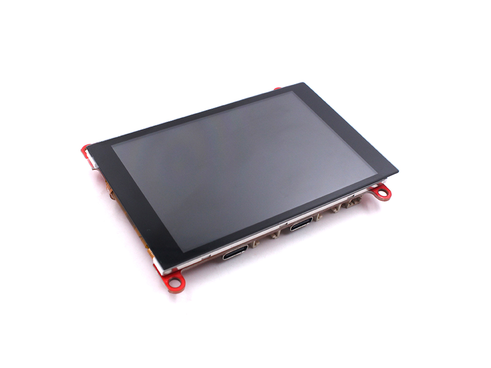
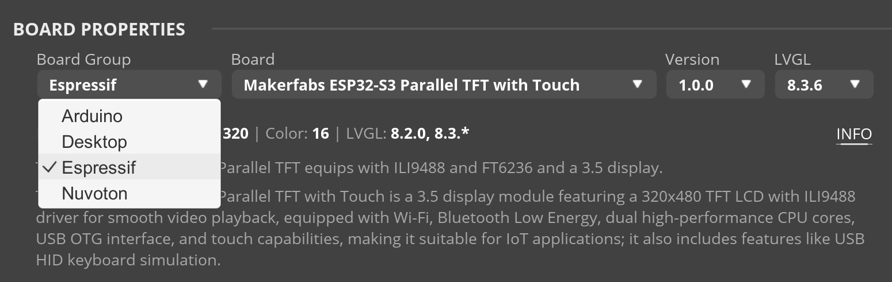

# SquareLine OBP for MakerFabs ESP32-S3 Parallel TFT with Touch

The Makerfabs ESP32-S3 Parallel TFT with Touch is a 3.5 display module featuring a 320x480 TFT LCD with ILI9488 driver for smooth video playback, equipped with Wi-Fi, Bluetooth Low Energy, dual high-performance CPU cores, USB OTG interface, and touch capabilities, making it suitable for IoT applications; it also includes features like USB HID keyboard simulation.

 


Hardware involved:

- LCD Driver: ILI9488(16bits parallel line)
- LCD Resolution: 480 x 320
- Touch panel controller: FT6236 Series ICs

## How to use

Download the files from the [latest release](https://github.com/hayschan/board_makerfabs_esp32_s3_parallel_tft_with_touch/releases).

1. Create a `Espressif/board_makerfabs_esp32_s3_parallel_tft_with_touch` folder in your OBP folder. The OBP folder is different for every OS. You should check SquareLine Studio [OBP documentation](https://docs.squareline.io/docs/obp) for.

```python
SquareLine
└── boards
  └── Espressif
      └── board_makerfabs_esp32_s3_parallel_tft_with_touch
```

2. Put the three files (`.zip`, `.slb`, `.jpg`) in the latest release inside the folder.

```python
SquareLine
└── boards
  └── Espressif
      └── board_makerfabs_esp32_s3_parallel_tft_with_touch
          ├── makerfabs_esp32_s3_parallel_tft_with_touch.slb
          ├── makerfabs_esp32_s3_parallel_tft_with_touch.zip
          └── ESP32-S3-Parallel-TFT-with-Touch-ILI9488.jpg
```

3. In SquareLine Studio's File->Project settings->Board Properties->Board, set Board Group as Espressif, and choose Board as "MakerFabs ESP32-S3 Parallel TFT with Touch".

 

## Disclaimer

I want to make it clear that while I’m excited to share the Board Support Package (BSP) for the MakerFabs 3.5" Touch TFT Parallel Display, I am not affiliated with MakerFabs in any official capacity. The BSP and the related information I’ve provided are based on my personal efforts and contributions, and I’m sharing them with the Squareline Studio community as a fellow enthusiast.

The BSP I’ve created is a result of my independent work and dedication, and I do not represent MakerFabs or have any official endorsement from them. I’m simply sharing my work with the community in the hopes that it will be useful to other Squareline Studio users who are interested in incorporating this hardware into their projects.

## Reference

- [LVGL + LGFX for MakerFabs 3.5" Parallel TFT ESP32-S2 and S3](https://github.com/radiosound-com/makerfabs-parallel-tft-lvgl-lgfx)